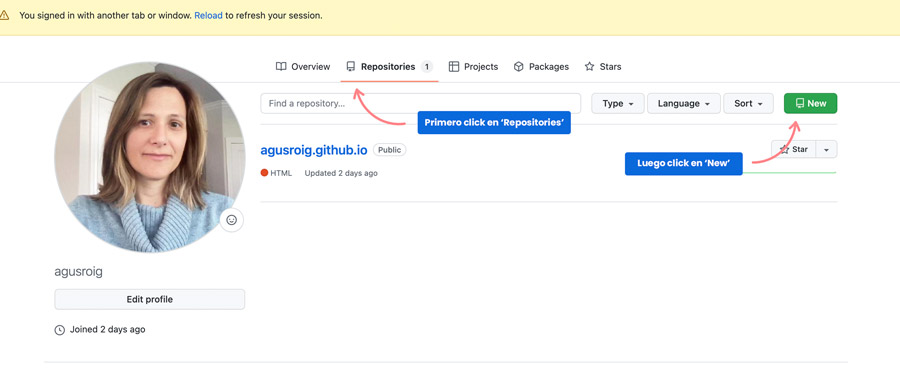
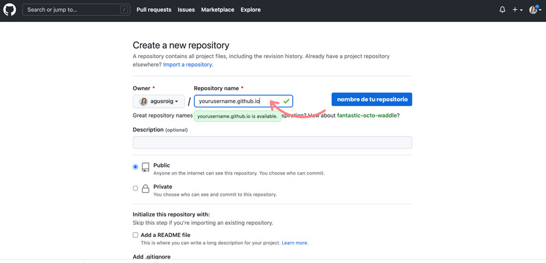
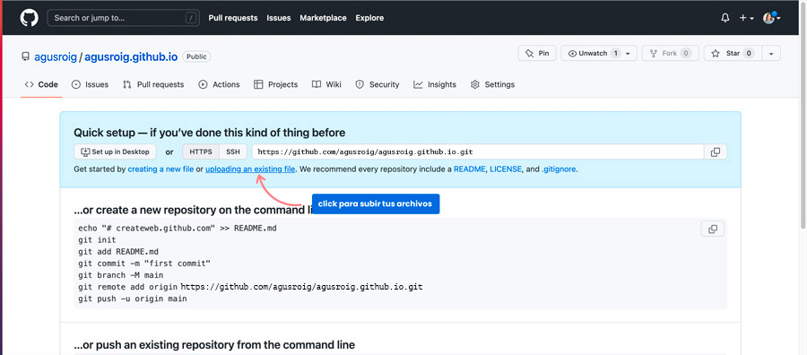
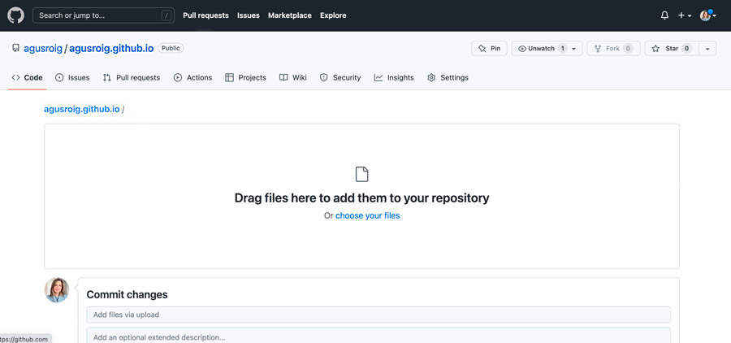
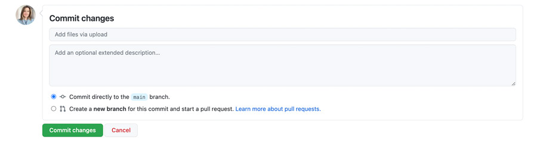
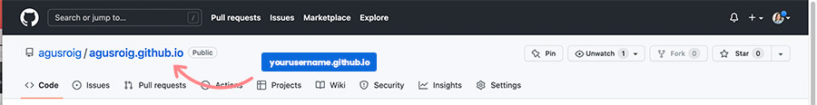

<h1>Crear un sitio web en GitHub:</h1>
    <h2>1.Crear un usuario en GitHub</h2>
    
Primero tenemos que crear un usuario en GitHub, para ello vamos al sitio de github <a href="https://github.com/">GitHub.com</a> y nos registramos, <b>Es Gratuito!</b>

    
    
deberás poner tu email, un nombre de usuario y contraseña

    
    <h2>2.Crear un repositorio</h2>
    
Una vez logueados vamos a "repositorios", hacemos click en "NEW" y le damos un nombre a nuestro nuevo repositorio, puedes poner tu nombre de usuario, se verá asi:

    
<b>nombredeusuario.github.io</b>

    
    
    <h2>3. Sube tus archivos</h2>
    
Una vez que el repositorio esta creado, debes subir tus archivos, si ya tienes tus archivos listos, puedes entrar en el link "Uploading an existing file"

    
    
Luego busca los archivos y arrastralos hacia la ventana "Drag files here...", luego haz commit de tus archivos.

    
    
    
<b>Listo!</b> tu sitio ya está creado, puedes navegarlo desde la url que haz creado con el nombre de tu repositorio: <b>nombredeusuario.github.io</b>

    
